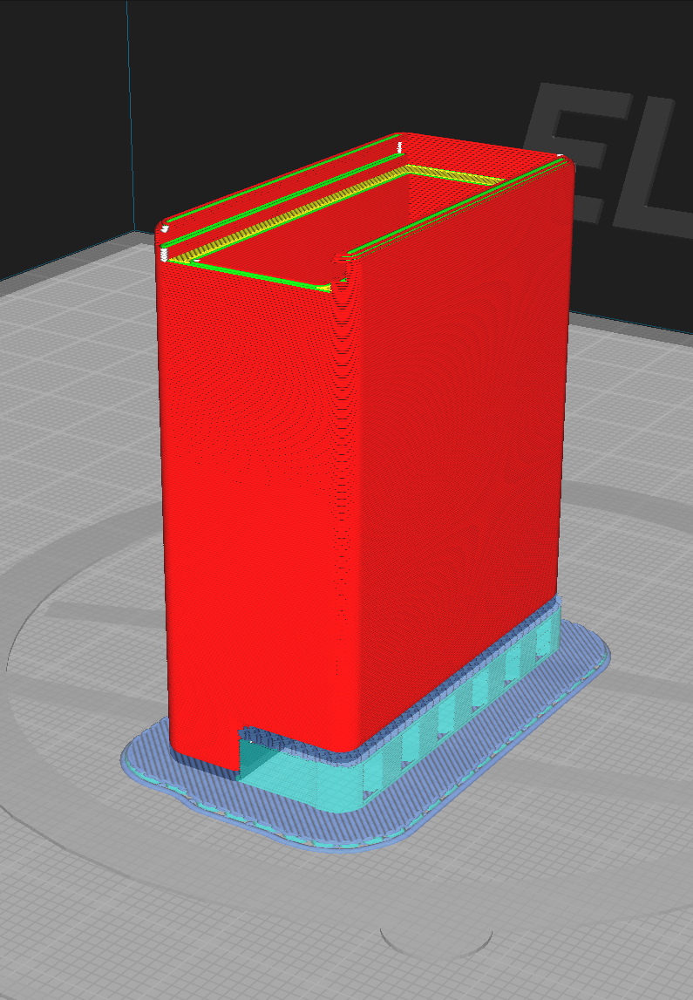

# ESP-32 Box
Huge thanks to `.ek.`, on discord, for the 3D-Model development and design!

## Print Settings
With UltiMaker Cura in mind.

Filament Type: PLA  
Nozzle: 0.4mm  
Layer Height: 0.2mm  

### Case
Support: Yes, Normal, Touching Buildplate  
Support Interface: Yes, Interface Density: 100%  
Build Plate Adhesion: Raft (to be safe)

### Case Lid
Support: Yes, tree  
Build Plate Adhesion: None (Or Raft if you run into issues)

